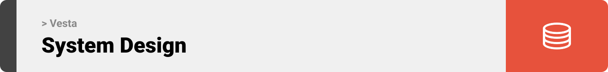

  

<!-- project overview -->

> A comprehensive smart home assistant that integrates inventory management, device control, and AI-driven insights.
>
> VestaApp unifies your home experience by connecting your pantry, recipes, and electrical devices into a single, intelligent interface.

  

<!-- System Design -->

### Architecture

- **Monorepo Structure**: Unified repository managing Server, AI, and Client services.
- **Backend (Laravel)**:
  - Handles Authentication (Sanctum).
  - Manages Business Logic for Rooms, Devices, Pantry, and Shopping Lists.
  - SQLite Database for lightweight, portable data storage.
- **AI Service (Django)**:
  - **Conversational AI**: Context-aware agent for home queries using LangChain.
  - **RAG System**: Vector database (ChromaDB) for recipe and instruction retrieval.
  - **Electrical Device Integration**: Direct control of ESP devices via API.
- **Client (React Native)**:
  - Built with Expo & TypeScript.
  - Android Application.
  - Modern, dark-themed UI with custom components.

  

<!-- Project Highlights -->

### Key Features

- **Smart Pantry**: Track inventory, expiry dates, and categorize items.
- **Recipe Intelligence**: Generate recipes based on available ingredients (RAG-powered).
- **Home Control**:
  - Add and manage Rooms and Devices.
  - Real-time status toggling for electrical devices.
- **Shopping Assistant**:
  - Automatic shopping list generation.
  - Item checking and management.
- **Personalized AI**:
  - Chat with Vesta for home assistance.
  - Context-aware responses based on your home's state.
- **Secure Authentication**: Robust user management and session handling.

  

<!-- Demo -->

### Mobile Interface

| Login & Auth                            | Smart Home Dashboard                       | Pantry & Inventory                       |
| --------------------------------------- | ------------------------------------- | ------------------------------------- |
|  |  |  |

### Key Workflows

| AI Chat Assistant                            | Recipe Details                       |
| --------------------------------------- | ------------------------------------- |
|  |  |

  

<!-- Development & Testing -->

### Getting Started

- **Prerequisites**:
  - Node.js & NPM
  - PHP 8.4 & Composer
  - Python 3.11 & Pip
- **Installation**:
  1. Clone the repository.
  2. **Laravel**: `cd VestaServer/Laravel` -> `composer install` -> `php artisan migrate`.
  3. **Django**: `cd VestaServer/Django/Ai` -> `pip install -r requirements.txt`.
  4. **Client**: `cd VestaClient` -> `npm install`.

### Testing

| Backend Tests                            | Client Validation                       | AI Model Checks                        |
| --------------------------------------- | ------------------------------------- | ------------------------------------- |
|  |  |  |

  

<!-- Deployment -->

### CI/CD Pipeline

- **GitHub Actions**:
  - **CI Backend**: Runs PHPUnit (Laravel) and Python checks (Django) on `VestaServer/**` changes.
  - **CI Client**: Runs Type Checking and Linting on `VestaClient/**` changes.
  - **CD Production**: Automatically deploys `main` branch to EC2.
- **Deployment Strategy**:
  - Automated `git pull`.
  - Service-specific dependency updates (`composer` / `pip`).
  - Database migrations (`php artisan migrate`).
  - Service restarts.

| Pipeline Status                            | Deployment Logs                       | API Health Check                        |
| --------------------------------------- | ------------------------------------- | ------------------------------------- |
|  |  |  |

  
