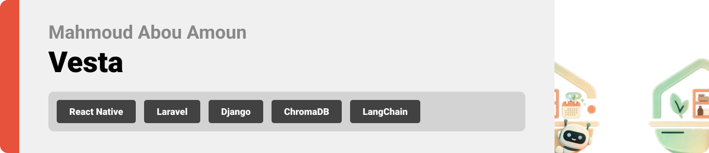

<br><br>

## License

[](https://opensource.org/licenses/MIT)

This project is licensed under the MIT License - see the [LICENSE](LICENSE) file for details.

<br><br>

<!-- project overview -->


> VestaApp is a comprehensive smart home assistant that integrates inventory management, device control, and AI-driven insights. 
> Unify your home experience by connecting your pantry, recipes, and electrical devices into a single, intelligent interface.

<br><br>

<!-- System Design -->


### System Design


### Database Schema
[View Interactive Diagram](https://dbdiagram.io/d/VestaDB-696f74f5bd82f5fce2052481)
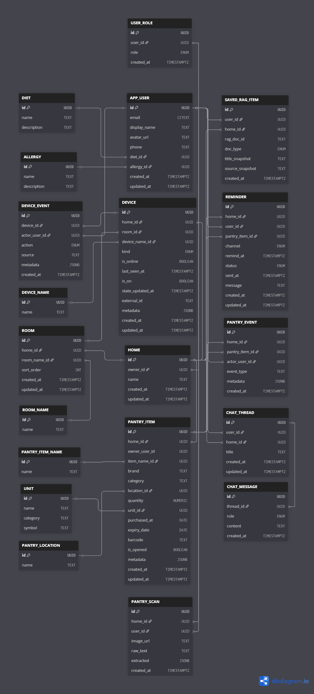

<br><br>

<!-- Project Highlights -->
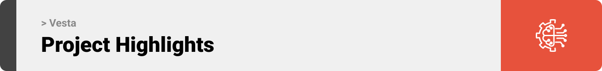

### Key Features


<br>

- **IoT Devices**: Connects directly to ESP32 hardware to monitor physical inventory and control home devices based on your environment.
- **RAG: Intelligent Memory**: Retrieves context from your personal logs to provide grounded, accurate suggestions based on your data.
- **Ai-Agent: Vesta Assistant**: An autonomous voice agent that controls your electrical devices and manages your pantry and shopping list through natural conversation.


### Vesta 
> This is your home assistant Vesta, she is here to help you with whatever you need.


<br><br>

<!-- Demo -->


### User Screens & Demos

| Welcome | Login | Signup | Google Verification |
| :---: | :---: | :---: | :---: |
|  | 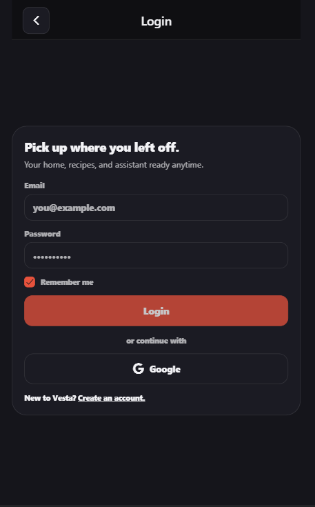 | 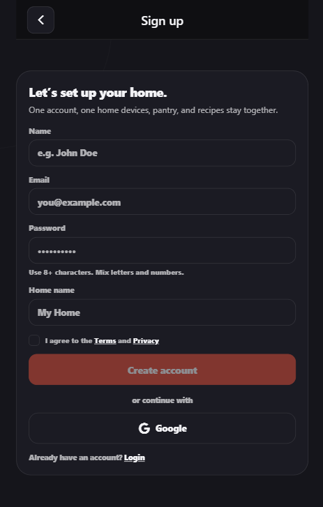 |  |

| Dashboard (Dark) | Dashboard (Light) | Room Details (Empty) |
| :---: | :---: | :---: |
| 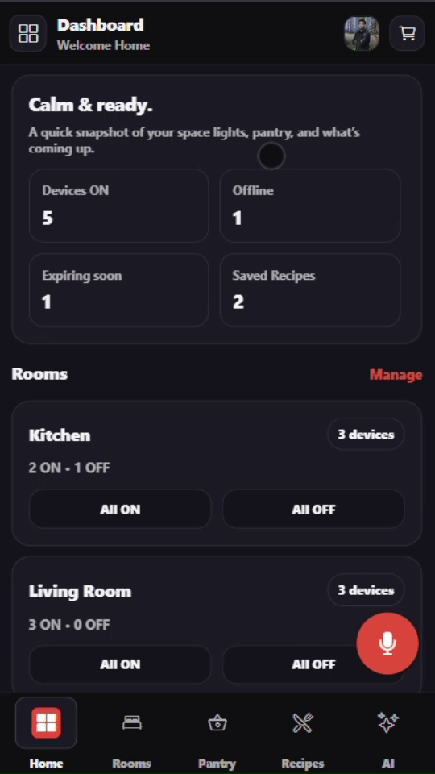 |  | 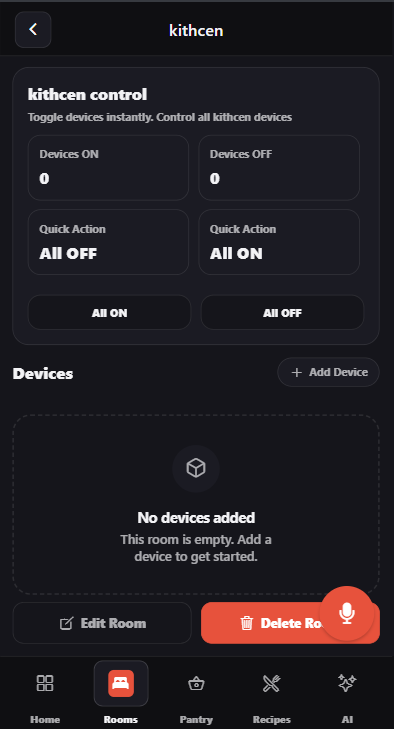 |

| Pantry (Full) | Pantry (Empty) | Pantry (Light) |
| :---: | :---: | :---: |
|  | 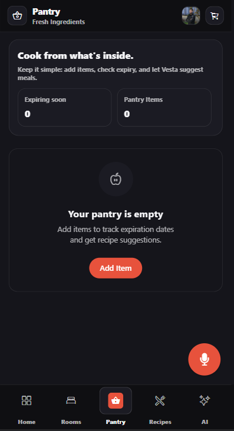 |  |

| Shopping List (Full) | Shopping List (Empty) | Shopping List (Light) |
| :---: | :---: | :---: |
|  | 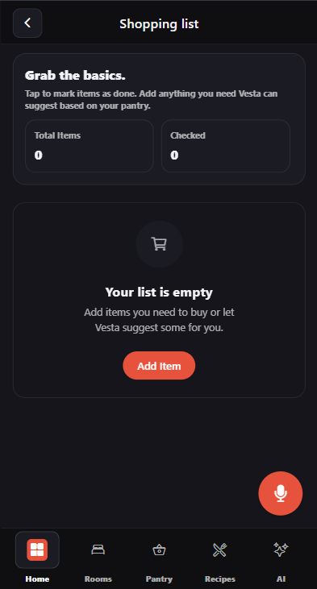 | 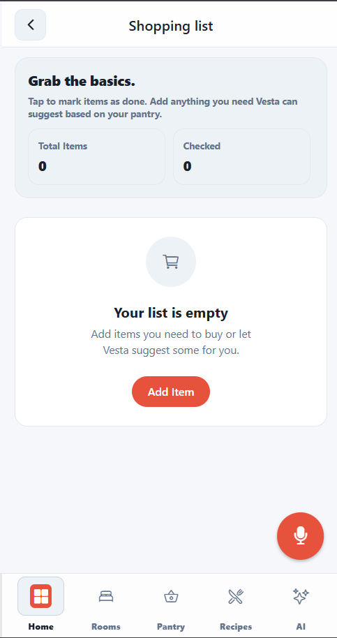 |

| Recipe Creation | Saved Recipes | No Saved Recipes |
| :---: | :---: | :---: |
|  | 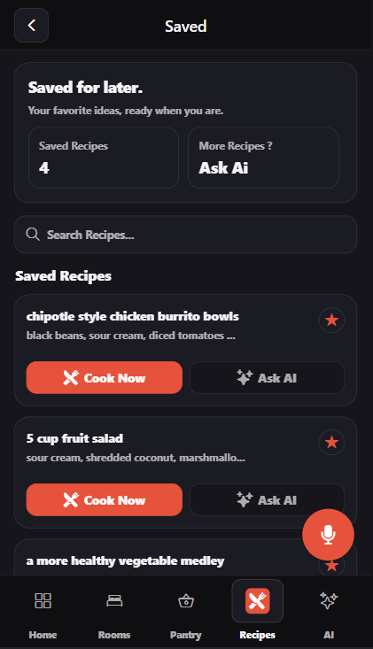 | 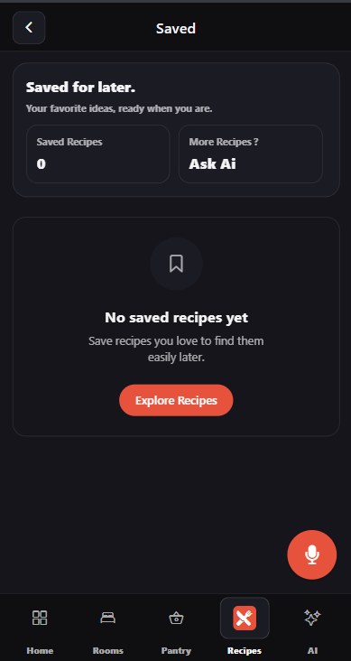 |

| Room Control | Rooms (Empty) | Rooms (Light) |
| :---: | :---: | :---: |
| 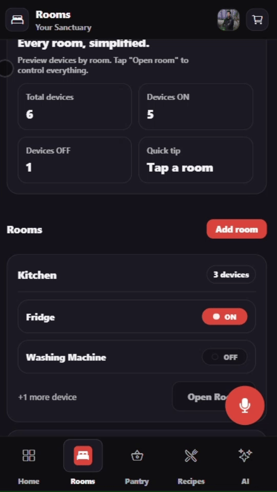 | 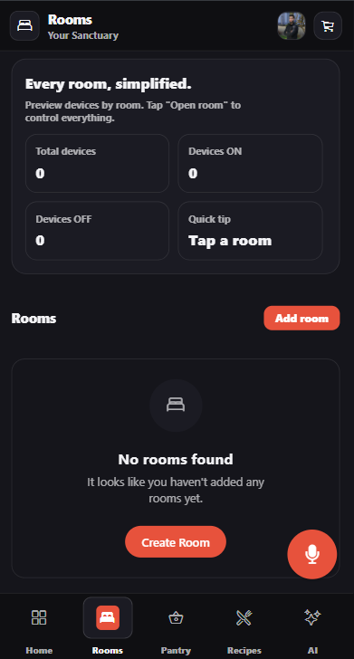 | 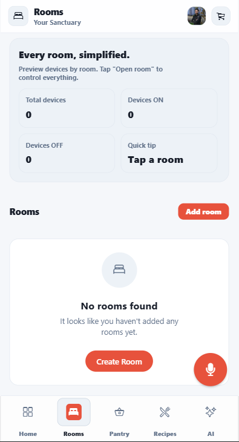 |

| Profile | About | Privacy Policy | Terms & Conditions |
| :---: | :---: | :---: | :---: |
| 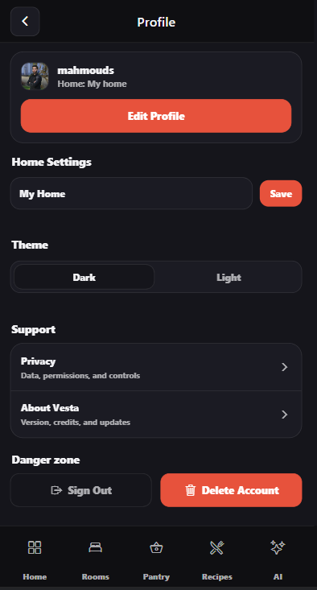 | 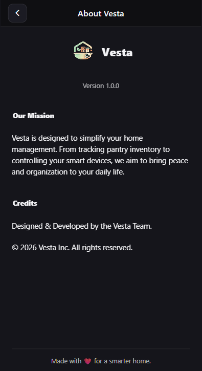 | 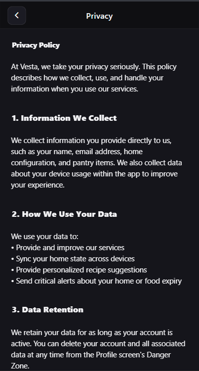 | 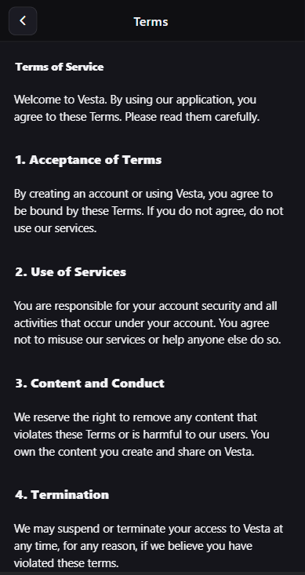 |

### IoT Control Demo


<br><br>

<!-- Development & Testing -->


### Development

- **Server**: `VestaAppServer` (Laravel & Django)
- **Client**: `VestaClient` (React Native/Expo)

### Testing & CI/CD

| Frontend Tests | Backend Tests | CI/CD |
| --------------------------------------- | ------------------------------------- | ------------------------------------- |
|  | 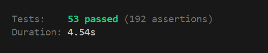 |  |

#### How to Run Tests

**Frontend (React Native)**
```bash
cd VestaClient/React-Native
npm test
```

**Backend (Laravel)**
```bash
cd VestaAppServer/Laravel
php artisan test
```


<br><br>

### Dataset 

- **RAG System**: Vector database for recipe retrieval.

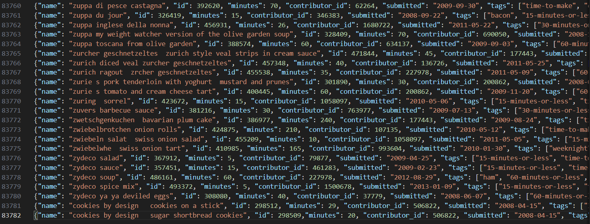

### AI Agent Workflow

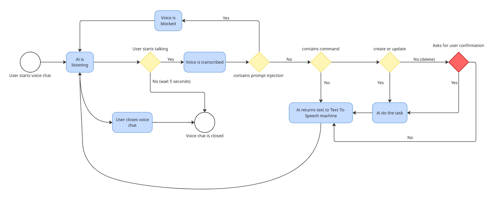

<br><br>

<!-- APIs -->


### API & Postman

| AI Chat | Rooms | Saved Recipes |
| :---: | :---: | :---: |
| 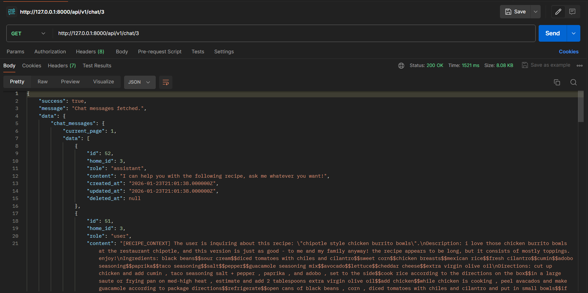 | 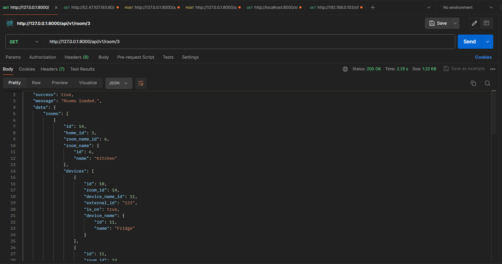 | 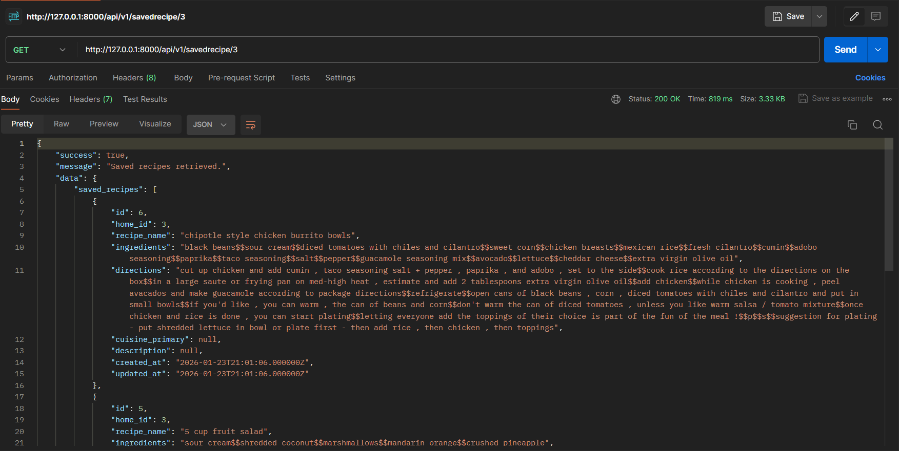 |

<br><br>


